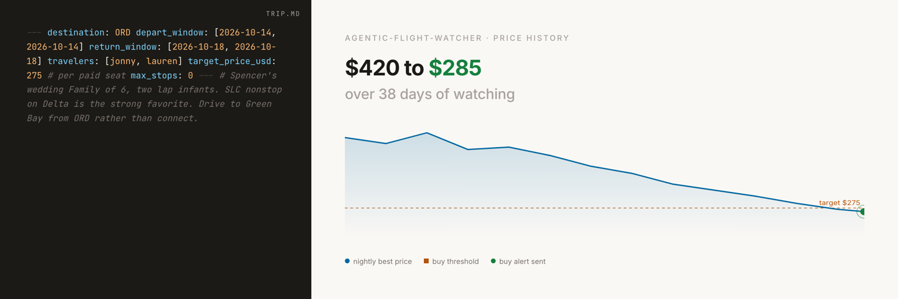

<p align="center">
  
</p>

# agentic-flight-watcher

Describe a trip in plain markdown. An agent prices it every few hours, keeps a per-trip price history, and emails you when it's time to book. A self-contained `dashboard.html` renders everything at a glance.

## Layout

```
agentic-flight-watcher/
├── AGENTS.md              agent instructions, read every cron tick
├── CLAUDE.md              symlink to AGENTS.md so Claude Code picks it up
├── home.md                your defaults (gitignored; copy from home.example.md)
├── home.example.md        template for home.md
├── dashboard.html         self-contained price-history view
├── <slug>.trip.md         one per active trip; you author these
├── <slug>.log.jsonl       observation log per trip (auto-appended)
├── archive/               completed and cancelled trips
└── lib/                   templates plus the dashboard generator
```

## Setup

### Agentic setup

After cloning, ask any agent that reads `AGENTS.md` ([Claude Code](https://github.com/anthropics/claude-code), [Codex](https://github.com/openai/codex), or similar):

> Set up this project per the Manual setup section in `README.md`. Install `fli`, walk me through filling in `home.md` from the template, schedule the cron, and help me add my first trip.

The agent handles every step. The one thing it can't do is run the `pipx install` line on your machine; it will pause and ask you to.

### Manual setup

1. `pipx install flights` (PyPI package is [`flights`](https://github.com/punitarani/fli); the installed binary is `fli`).
2. `cp home.example.md home.md` and edit. The only required fields are your home airport and the `travelers:` name-to-email map; everything else is commented and optional.
3. Open the project in your agent of choice (`claude`, `codex`, etc.) from the repo root so it picks up `AGENTS.md`. Then ask:

   > Schedule the flight watcher to run every 3 hours per AGENTS.md, durable.

   With [Claude Code](https://github.com/anthropics/claude-code) this creates a built-in scheduled task that fires only while a session is open and auto-expires after 7 days, so keep `claude` open in a persistent terminal (`tmux`, `screen`) and re-register weekly. For agents without a native scheduler, use system cron with something like `0 */3 * * * cd /path/to/agentic-flight-watcher && <your-agent-cli> -p "execute the research procedure in AGENTS.md"`.
4. To verify, ask the agent: *"run the procedure once now."* It will research any trips you've added, regenerate `dashboard.html`, and report back.

## Trips

```sh
cp lib/example.trip.md tokyo-vacation.trip.md
```

Edit the YAML frontmatter (`destination`, `depart_window`, `return_window`, `travelers` at minimum) and add free-form notes underneath. The agent reads the prose too: "no red-eyes," "prefer Delta nonstop with the lap infant on the return," "drive to ORD instead of connecting" are all valid. `lib/example.trip.md` documents every supported field.

To complete a trip, move its `.trip.md` and `.log.jsonl` into `archive/`. The cron also does this automatically once both travel windows are in the past.

## Dashboard

`lib/build-dashboard.py` regenerates `dashboard.html` from every trip and log file. The cron runs it each tick. The output is a single file with all data inlined and Chart.js plus marked.js pulled from CDN. Open it with `file://` in any browser; no server.

## How it works

Each cron tick the agent reads every `<slug>.trip.md`, merges defaults from `home.md`, prices the most plausible itinerary permutations with [`fli`](https://github.com/punitarani/fli), appends observations to the trip's log, decides whether to email a buy signal, and regenerates the dashboard. A trip's first run sends a research briefing email instead of a buy signal so you start with context. The full procedure lives in `AGENTS.md`.

## Requirements

- **An agent runtime that reads `AGENTS.md`.** [Claude Code](https://github.com/anthropics/claude-code), [Codex](https://github.com/openai/codex), or anything equivalent. Claude Code has built-in durable scheduled tasks; with other agents, drive the loop from system cron pointed at the agent's headless mode.
- **[Python 3.10+](https://www.python.org/)** for the dashboard generator (`lib/build-dashboard.py`).
- **[`fli`](https://github.com/punitarani/fli)** for flight pricing. Reverse-engineers Google Flights; no API key needed.
- **A browser-automation skill** the agent can call. `fli` handles most queries, but multi-city itineraries, basic-vs-main fare splits, lap-infant confirmation, and transient Google Flights API regressions all need a real browser fallback. In Claude Code this is the `dev-browser` skill ([anthropics/skills](https://github.com/anthropics/skills)); other agents typically use a [Playwright](https://github.com/microsoft/playwright) integration. Results degrade noticeably on complex trips without one.
- **A Google Workspace CLI is preferred.** The original setup uses `gws` with `gwsp` / `gwsw` aliases for two accounts. It gives the agent two things in one place: notification email for buy signals, and calendar access so the agent can sanity-check trip dates against your actual calendar before recommending a booking. Substitute the [Gmail MCP server](https://github.com/modelcontextprotocol/servers) or any other email tool the agent can reach if you don't run `gws`; calendar-aware logic will be limited or unavailable. The send step in `AGENTS.md` is the only place to swap.

## Agent runtime

Instructions live in `AGENTS.md` per the [AGENTS.md convention](https://agents.md). [Codex](https://github.com/openai/codex) reads `AGENTS.md` natively; [Claude Code](https://github.com/anthropics/claude-code) reads `CLAUDE.md`, so `CLAUDE.md` here is a 9-byte symlink to `AGENTS.md`. For other runtimes, `ln -s AGENTS.md WHATEVER.md`.

## License & credits

MIT. Built on [`fli`](https://github.com/punitarani/fli), [Chart.js](https://github.com/chartjs/Chart.js), [marked](https://github.com/markedjs/marked), and runs on any agent that reads [AGENTS.md](https://agents.md) ([Claude Code](https://github.com/anthropics/claude-code), [Codex](https://github.com/openai/codex), etc.).
